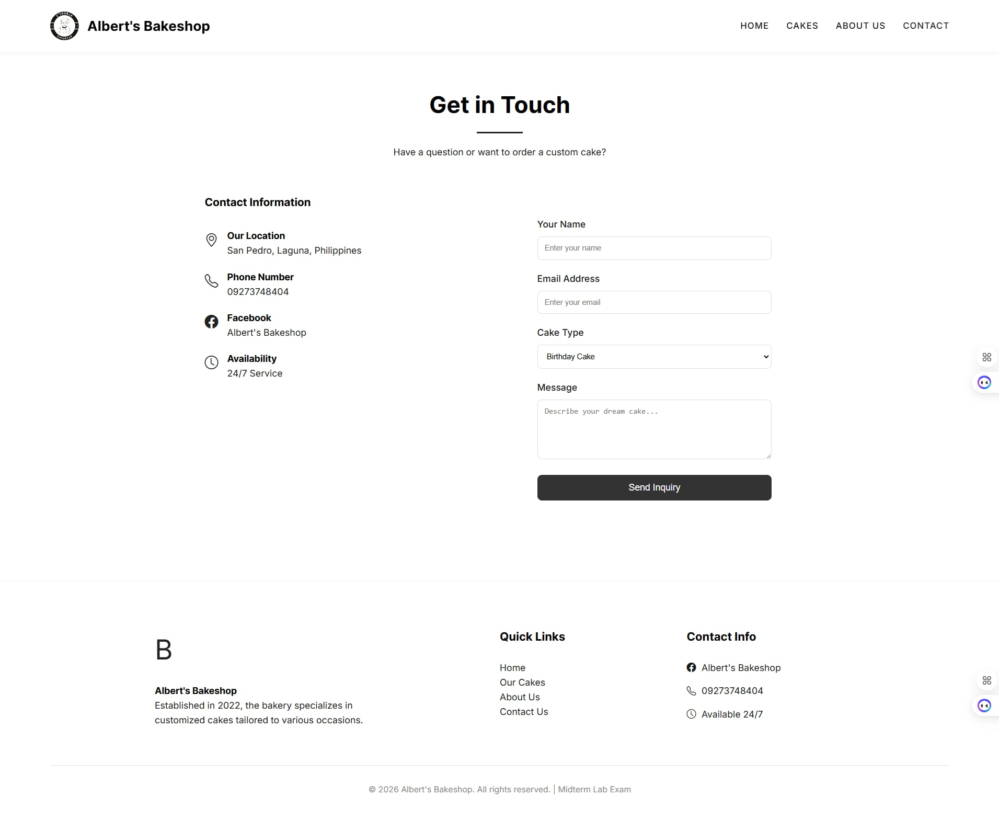
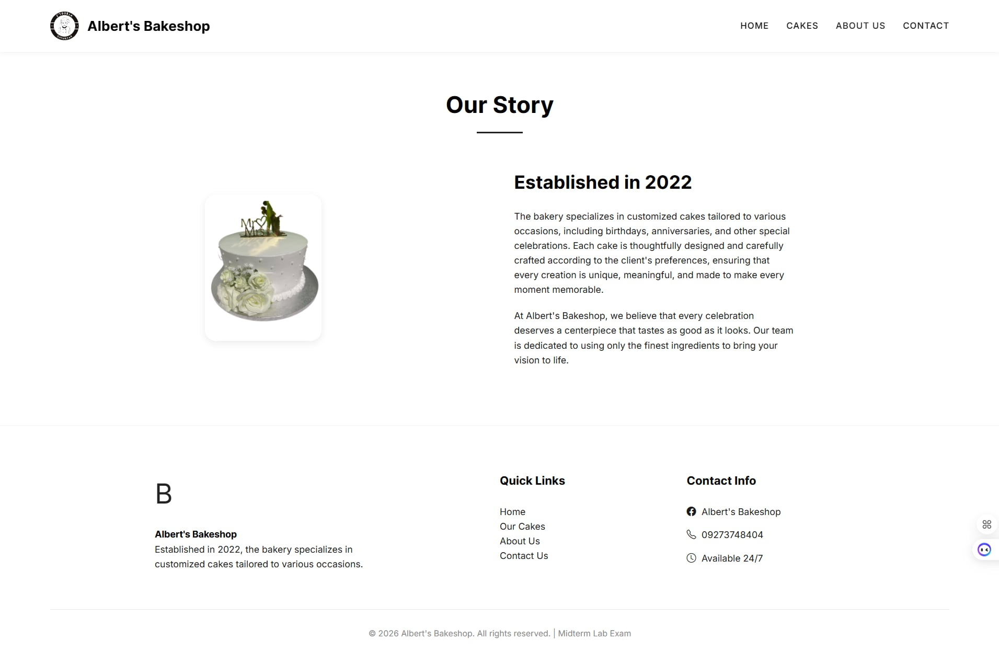
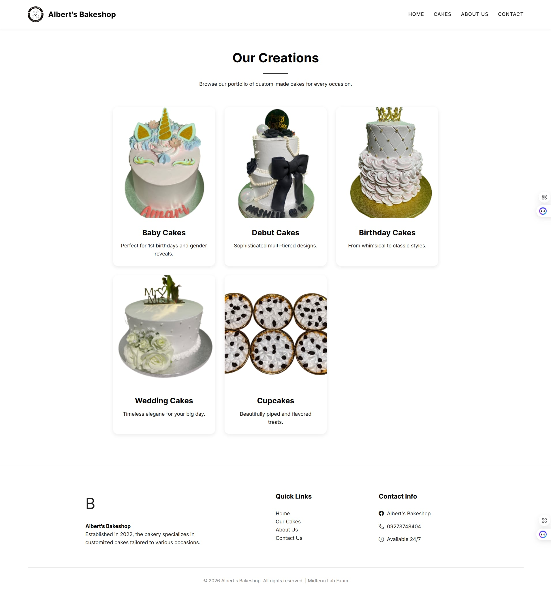
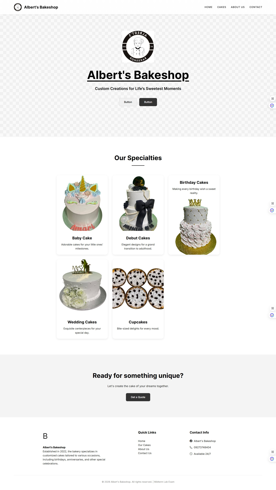

# Albert's Bakeshop - Midterm Lab Exam

## Project Information
**Student Name:** S. A. Fernandez  
**Course & Section:** WBDV111 - Midterm Lab  
**Project Title:** Albert's Bakeshop Website  
**Contact:** safernandez2043ant@student.fatima.edu.ph

## Project Description
Albert's Bakeshop is a responsive, multi-page website established in 2022 to showcase customized cakes for various occasions like birthdays, anniversaries, and weddings. The project emphasizes premium design, clean typography, and a user-friendly interface.

## Features Implemented
- **Responsive Design:** Fully mobile-friendly layout using CSS Flexbox and Grid.
- **Hero Section:** Engaging landing area with clear call-to-action buttons.
- **Product Portfolio:** Categorized display of cake specialties (Baby, Debut, Birthday, Wedding, Cupcakes).
- **Navigation:** Multi-page system with Home, About Us, Cakes, and Contact pages.
- **Interactive Elements:** Dynamic sticky header, mobile toggle menu, and scroll-reveal animations.
- **Functional Forms:** Inquiry form for custom cake orders.
- **SEO Optimized:** Semantic HTML5 tags and descriptive meta data.

## Folder Structure
- `/index.html` - Homepage
- `/about.html` - About Us
- `/contact.html` - Contact Information & Form
- `/products.html` - Cake Gallery
- `/css/style.css` - Custom Styling
- `/assets/` - Logo and Images
- `/js/main.js` - Interactive functionality

## Screenshots

---
*Created for WBDV111 Midterm Lab Exam*
